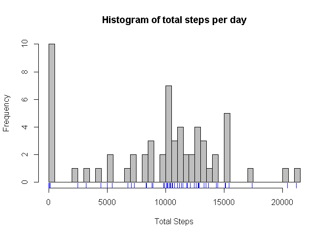
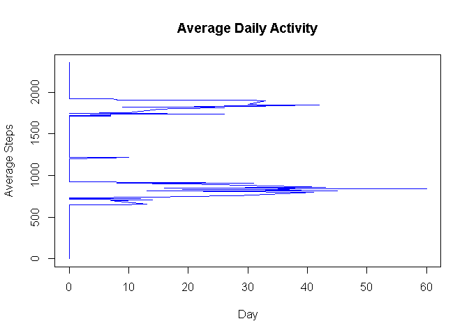
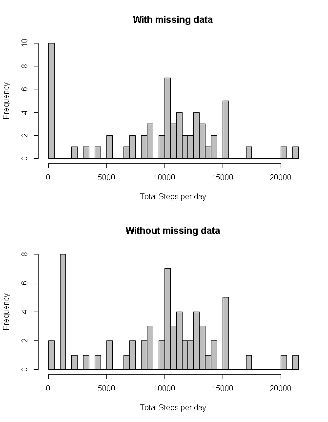
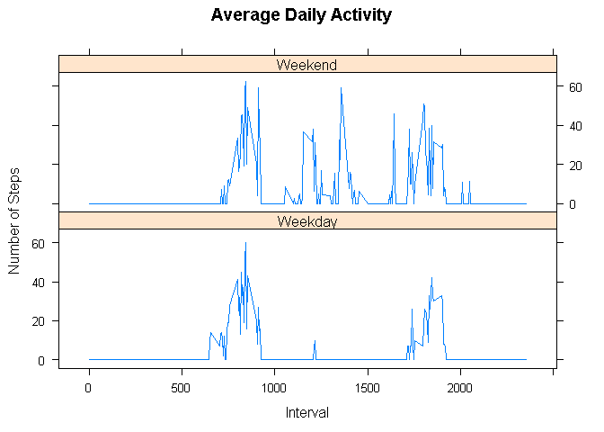

# Reproducible Research: Peer Assessment 1

## Summary

With more devices for personal movement monitoring on the increase as well as fitness and tech geeks, a vast amount of data is collected. In this report, data from one subject's personal activity monitoring device is used to establish activity levels and pattern for two months (October - November 2012).

The data is collected at a 5 minute interval each day and has about 13.11% percent of missing values. This had an impact on the total number of steps taken per day as it lumped the missing values at zero and thereby reducing the mean. To correct this, the interval's averages were used to fill up the missing values.

From the complete dataset, on average, the subject took 10,395 steps per day and was most active at about 8.45am. Comparing weekend and weekday activities, the subject was most active over the weekend and less active over the weekdays.

In general, a noted pattern was evident where the subject was most active at two time periods, that is, in the early hours of the day and in the late afternoon/early evening. The subject can be classified as 'active'.

## Loading and preprocessing the data

After forking and cloning the [GitHub repository](http://github.com/rdpeng/RepData_PeerAssessment1), the folder is unziped before reading in the data which is in a comma separated file. Note, working directory is set to the assignment folder ("RepData_PeerAssessment1").


```r
unzip("activity.zip")
data <- read.csv(file = "activity.csv", stringsAsFactors = FALSE)
str(data)
```

```
## 'data.frame':	17568 obs. of  3 variables:
##  $ steps   : int  NA NA NA NA NA NA NA NA NA NA ...
##  $ date    : chr  "2012-10-01" "2012-10-01" "2012-10-01" "2012-10-01" ...
##  $ interval: int  0 5 10 15 20 25 30 35 40 45 ...
```

A quick check of the dataset using the str() function, we see that the dataframe has 17,568 observations and three variables. Two of the variables are integers (steps and interval) while another (date) is a character variable. As part data processing, a time variable is added by transforming the date and interval into a date/time object and spliting it to obtain the time.


```r
time <- strsplit(as.character(seq(strptime(paste(data$date[1], "00:00:00"), tz = "UTC", format = "%Y-%m-%d %H:%M:%S"), by = 300, length.out = length(data$interval))), " ")
time <- sapply(time, "[", 2)
data$time <- time
```
 

## Mean total number of steps taken per day

To compute the mean total number of steps taken per day, the `by()` function is used to group the data into days before computing the totals for each day (missing data is suppressed). A histogram is ploted to show the distribution of daily activity. For clarity, `breaks` has been increase a bit, to show the difference in the activity levels. 


```r
total.steps.per.day.1 <- as.vector(with(data, by(data = steps, date, sum, na.rm = TRUE)))
hist(total.steps.per.day.1, breaks = 50, col = "grey", main = "Histogram of total steps per day", xlab = "Total Steps")
rug(x=total.steps.per.day.1, col = 4)
```

 

```r
mean.total.per.day.1  <- mean(total.steps.per.day.1)
median.total.per.day.1 <- median(total.steps.per.day.1)
```

Due to missing values, the mean has been reduced to about 9354 steps per day. The median is slightly higher at 10395 steps per day.

As the average is greater than 10,000 steps, the subject can be classified as 'active'.

## Average daily activity pattern

Daily activity pattern is computed using the aggregate function which gets the averages across all time intervals.   


```r
average <- aggregate(x = data$steps, by = list(data$interval), FUN = median, na.rm = TRUE)
with(average, plot(x = x, y = Group.1, type = "l", main = "Average Daily Activity", xlab = "Day", ylab = "Average Steps", col = 4))
```

 

```r
max.interval <- average[average$x == max(average$x), "Group.1"]
```

The graph shows an interesting pattern where the subject seems to be active at two time points daily for the first month and then at one time point in the better part of the second month. On average, the time of day that the subject is most active is around 08:45:00. 

## Imputing missing values

Missing data generally tend to imapact data analysis. Hence, to get the total of missing values, the is.na() function is used.


```r
nMissing <- length(data[is.na(data)])
```

From the computation, missing data accounts for about 13.11 percent of the total dataset. This is quite a substantial amount and it's impact on estimates of the total daily number of steps is assessed by first filling the missing values with the average of their interval and then fitting a histogram.


```r
ind <- which(is.na(data$steps))
intervals <- data$interval[ind]
data2 <- data
data2$steps[ind] <- sapply(intervals, function(x) if(x %in% average$Group.1) average$x[which(x == average$Group.1)])
total.steps.per.day.2 <- as.vector(with(data2, by(data = steps, date, sum)))
par(mfrow = c(2,1))
hist(total.steps.per.day.1, breaks = 50, col = "grey", main = "With missing data", xlab = "Total Steps per day")
hist(total.steps.per.day.2, breaks = 50, col = "grey", main = "Without missing data", xlab = "Total Steps per day")
```

 

```r
par(mfrow=c(1,1))
```

The histograms shows that data with missing values tend to lump the missing values on 0, but if filled with their averages, then it distributes the missing values towards the center of the data. 


```r
mean.total.per.day.2  <- mean(total.steps.per.day.2)
median.total.per.day.2 <- median(total.steps.per.day.2)
names <- list(c("With Missing", "Complete Cases"), c("Mean", "Median"))
matrix(c(round(mean.total.per.day.1, 0), round(mean.total.per.day.2, 0), median.total.per.day.1, median.total.per.day.2), nrow = 2, ncol = 2, dimnames = names)
```

```
##                Mean Median
## With Missing   9354  10395
## Complete Cases 9504  10395
```

Missing values on average affects the mean by reducing it. In this case the mean was pulled down to 9354 steps by the missing values. When they were filled, the vaues brought it closer to the median, that is, the mean of 9504 steps with the median being 10395 steps. The median is never affected as it takes the position of the values rather than the individual values. 

## Activity patterns between weekdays and weekends?

To estimate the difference in activity patterns between the weekdays and weekends, a factor variable is added indicating which day of the week it is.


```r
day <- weekdays(as.Date(data2$date))
weekdays <- unique(day)[1:5]
data2$day <- ifelse(day %in% weekdays, "Weekday", "Weekend")
table(data2$day)
```

```
## 
## Weekday Weekend 
##   12960    4608
```

From the new variable, the average number of steps taken across all weekday days and weekend days is computed and then plot against the time intervals.


```r
average2 <- aggregate(x = data2$steps, by = list(data2$interval, data2$day), FUN = median)
library(lattice)
xyplot(x ~ Group.1 | Group.2, data = average2, type = "l", layout = c(1, 2), main = "Average Daily Activity", xlab = "Interval", ylab = "Number of Steps")
```

 

Interestingly, the subject seems to be more active over the weekends than on the weekdays. Over the weekend, the subject has fluctuaing activity levels between 06:00:00 and about 19:00:00. However, during the weekdays, the subject seems to have a consistent time period of activity. The first period is in the morning between 06:00:00 and about 09:40:00. The second period is in the late afternoon/early evening between 17:00:00 and about 19:00:00. 

## Conclusion

On average, the subject seems to be 'active' with about 10395 steps. This is according to [a pubmed publication](http://www.ncbi.nlm.nih.gov/pubmed/14715035), where they suggest a classification of pedometer reading. However, in asmuch as the review suggests an active lifestyle, the data also shows sporadic difference not only between different time intervals but also between weekdays and weekends. Overall, classification of the steps taken would depend on the subject's underlining reason for using it and their ultimate goal.
